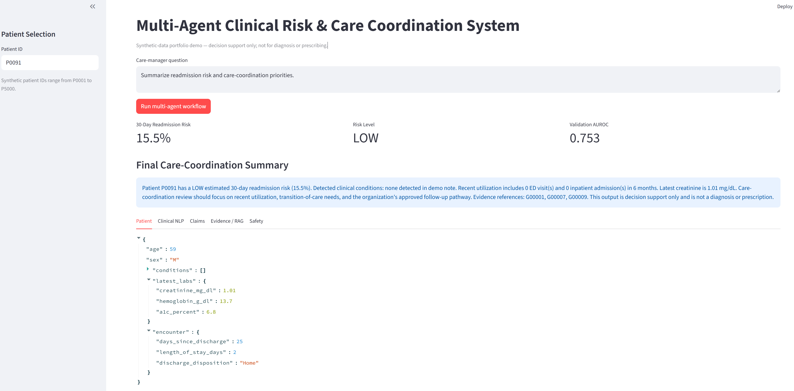

# Multi-Agent Clinical Intelligence & Care Coordination System

This project developed a multi-agent healthcare AI system integrating clinical NLP, EHR/claims
analytics, predictive ML, RAG, and safety evaluation to automate patient risk
assessment and evidence-grounded care-coordination insights.

---

## 1. Business problem


Summarize this recently discharged patient's 30-day readmission risk,
important clinical/utilization signals, and evidence-grounded
care-coordination priorities.

Instead of asking one LLM to do everything, the system uses specialized agents.

---


## 2. Agent workflow

```text
                         User
                           |
                           v
                    Supervisor Agent
                           |
          +----------------+----------------+
          |                |                |
          v                v                v
   Patient Data       Clinical NLP       Claims Agent
      Agent               Agent
          |                |                |
          +----------------+----------------+
                           |
                           v
                       Risk Agent
                           |
                           v
                    Evidence/RAG Agent
                           |
                           v
                    Synthesis Agent
                           |
                           v
                      Safety Agent
                       /        \
                    PASS        FAIL
                     |            |
                  Final       Repair output
```

The three first specialist agents are modeled as parallel LangGraph branches.
The graph waits for all three before continuing to the risk agent.

---

## 3. Output



---

## 4. What each agent does

### Supervisor Agent
Validates the patient ID and creates the execution plan.

### Patient Data Agent
Summarizes:
- age/sex
- comorbidities
- recent discharge
- laboratory values

### Clinical NLP Agent
Processes clinical notes using:
- medical term matching
- fuzzy matching for abbreviations/typos
- simple symptom/risk-flag extraction

Production extension:
- ClinicalBERT/BioBERT
- LLM structured extraction
- medical NER

### Claims Agent
Computes:
- ED visits
- inpatient admissions
- specialist visits
- recent allowed amount
- high-utilization flag

### Risk Agent
Uses a Random Forest model to estimate synthetic 30-day readmission risk.

The project intentionally keeps predictive ML separate from the LLM:
the model predicts; the LLM explains/summarizes.

### Evidence/RAG Agent
The local demo uses TF-IDF retrieval over small synthetic evidence snippets.

Production replacement:
- Amazon Bedrock Knowledge Bases
- vector search
- metadata filters
- reranking
- enterprise source documents

### Synthesis Agent
Creates a care-coordination summary.

Default:
- deterministic local synthesis
- no API key required

Optional:
- Amazon Bedrock Converse API

### Safety Agent
Checks for:
- diagnosis/prescribing language
- missing evidence references
- missing "decision support" limitation

If the output fails, it is repaired before final delivery.

---

## 5. Raw datasets

Located in `data/raw/`.

| File | Rows | Purpose |
|---|---:|---|
| `patients.csv` | 5,000 | demographics + comorbidity indicators |
| `claims.csv` | 5,000 | utilization + allowed amount |
| `labs.csv` | 5,000 | creatinine, hemoglobin, A1c |
| `encounters.csv` | 5,000 | discharge/encounter information |
| `clinical_notes.csv` | 5,000 | synthetic discharge summaries |
| `labels.csv` | 5,000 | synthetic 30-day readmission target |
| `guidelines.csv` | 5,000 | synthetic RAG evidence corpus |


## 6. Install

```bash
python -m venv .venv
```

Windows:

```bash
.venv\Scripts\activate
```

Install packages:

```bash
pip install -r requirements.txt
```

---

## 6. Run

Train the model explicitly:

```bash
python scripts/train_risk_model.py
```

Or simply run the demo; the model trains automatically the first time:

```bash
python run_demo.py --patient P0095
```

Try another patient:

```bash
python run_demo.py --patient P0042 --query "Why is this patient at risk?"
```

Streamlit:

```bash
streamlit run app_streamlit.py
```

---


## 7. Disclaimer

This repository is an educational portfolio project. It is not a medical
device and must not be used for clinical diagnosis, prescribing, or treatment.
